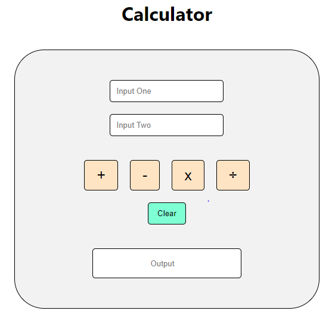

# React-Calculator
This is a simple calculator implemented using React which can do the following operations :

1. Addition
2. Subtraction
3. Multiplication
4. Division

## Validation
1. Input fields are mandatory (without input values if someone click on any button then it shows an alert message).
2. Input fields allow only number.

## Screenshot

